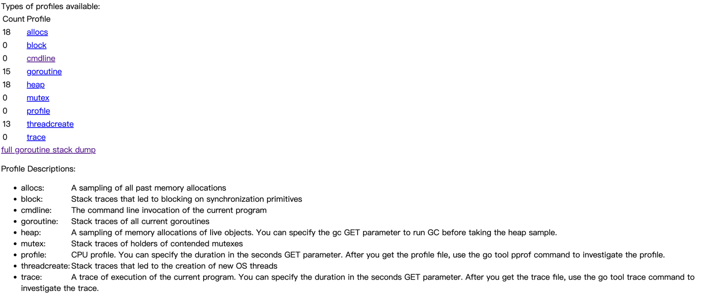

## PPROF实战运用

### 初识pprof
pprof是golang自带的程序性能分析工具,prof是profile(画像)的缩写.
Program Profile:程序画像,即程序运行时的一些画像,如:内存,CPU,协程,锁等等;
- 分析类型
  
    - allocs:所有过去内存分配的采样
    - block:阻塞分析
    - cmdline:当前程序的命令行调用
    - goroutine:goroutine分析
    - heap:内存分析
    - mutex:互斥锁分析
    - profile:cpu分析
    - threadcreate:导致创建新操作系统线程的堆栈跟踪
    - trace:当前程序的执行轨迹
- 常用的:CPU,Goroutine,Memory

### 项目结构
- once:为工具性或一次性程序添加pprof
- server:为服务型应用添加pprof
- static:静态资源,主要存储Markdown引用的图片

### 插件安装

#### 安装Graphviz
简介:Graph Visualization Software(图形可视化软件).Graphviz 是开源图形可视化软件。图形可视化是一种将结构信息表示为抽象图和网络图的方法。它在网络、生物信息学、软件工程、数据库和网页设计、机器学习以及其他技术领域的可视化界面中有着重要的应用。
- MacOS
    - homebrew安装:`brew install graphviz` :如果因为package的问题,可以先`brew update`
    - 确认是否安装成功:`dot --version || brew info graphviz`
- Windows安装
    - [下载msi安装包](https://graphviz.gitlab.io/_pages/Download/windows/graphviz-2.38.msi)
- Linux
    - Ubuntu/Debian:`sudo apt install graphviz`
    - CentOS/Redhat:`sudo yum install graphviz`
#### 安装Google的pprof
- 安装
    - go1.16之后:`go install github.com/google/pprof@latest`
    - go1.14之后:`go get -u github.com/google/pprof`
- 验证
    - `pprof -h`
    - 如果报错:`command not found`,执行`echo 'export PATH=$PATH:$(go env GOPATH)/bin' >> .zshrc`,然后`source .zshrc`,再次执行即可
#### pprof使用
- 打开已存在的文件:`pprof -http=:8080 cpu.pdf`
- 打开接口文件:`pprof -http=:8081 http://localhost:8888/debug/pprof/goroutine`

### 参考文献
- [Graphviz官网](https://www.graphviz.org/)
- [Drawing graphs with dot](https://www.graphviz.org/pdf/dotguide.pdf)